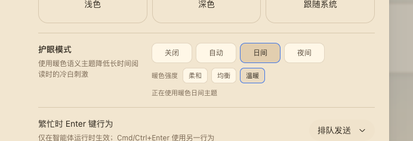
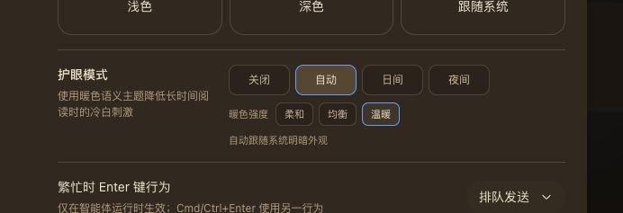

# DSH Eye Care

English | [中文](README.zh.md)

Warm Light, Warm Dark, System-Aware.

A DeepSeek Harness Web profile bundle that replaces cool white interface colors with six warm semantic themes while leaving the native Appearance preference intact.

<p align="center">
  
  
</p>

## What it does

DSH Web's built-in Light and Dark themes are cool-toned. Eye care adds a warm light palette, a warm dark palette, and an automatic scheme without a global sepia filter or image transform.

- **Four operating modes:** `off`, `auto`, `light`, and `dark`.
- **Three warmth levels:** `soft`, `balanced`, and `warm`.
- **Six concrete themes** registered through the official ThemeService.
- **Real semantic tokens** for backgrounds, text, borders, buttons, sidebar, bubbles, inputs, code blocks, scrollbars, and Shiki colors.
- **Native Appearance stays authoritative:** choosing Light, Dark, or System turns eye care off and keeps that newly selected theme.
- **Loopback persistence** stores the selection in Host settings; remote browsers keep the selection in the current process.

## Preview

The screenshots above show the General settings row in warm day mode and warm night mode. Day and Night are explicit; Auto follows `prefers-color-scheme` at the selected warmth. The row also renders an `aria-live` status and keyboard-visible focus states.

## Install

Install the public npm package into the Web profile:

```sh
dsh plugin --profile web add @anionex/dsh-eye-care
```

For local development, replace the package name with the checkout's absolute path or a locally packed tarball. `DSH_HOME` defaults to `~/.dsh`; point it at a temporary directory to try the bundle without changing your main profiles.

Restart or start the Web UI:

```sh
dsh web
```

Open **Settings → General → Eye care** and choose a mode and warmth.

## Theme matrix

| Scheme | Soft | Balanced | Warm |
|---|---|---|---|
| Light | `eye-care-light-soft` | `eye-care-light-balanced` | `eye-care-light-warm` |
| Dark | `eye-care-dark-soft` | `eye-care-dark-balanced` | `eye-care-dark-warm` |

## How it works

The Host half registers the `eye-care` Settings namespace and exposes a loopback-only Connection RPC channel `/eye-care`. Writes are serialized and fenced by `expectedRevision`; a conflict re-reads the Host snapshot and retries the latest intent.

The browser half registers the six themes, injects the General-settings row, and owns the controller lifecycle. The controller subscribes to `theme/change` and `prefers-color-scheme`, restores the pre-eye-care theme on disable or unload, and unregisters every theme on dispose. Remote browsers do not inject the Host RPC and therefore stay process-local.

## Compatibility and limitations

- Requires a DeepSeek Harness Web profile with the standard `settings`, `connection`, `locale`, `slots`, and `theme` services.
- A native Appearance change is treated as an explicit opt-out by design.
- Remote browser sessions do not persist eye care back to the Host.
- There is no global color filter; all colors come from named semantic tokens.
- The package is pre-release and follows the profile bundle format; its generated theme ids are stable while the bundle is installed.

## Development

```sh
cd dsh-eye-care
pnpm install --frozen-lockfile
pnpm run check
pnpm run test
pnpm run build
```

Run the optional clean-profile installation test:

```sh
DSH_EYE_CARE_PROFILE_E2E=1 pnpm exec vitest run tests/profile-install.e2e.spec.ts
```

## License

[MIT](LICENSE)
